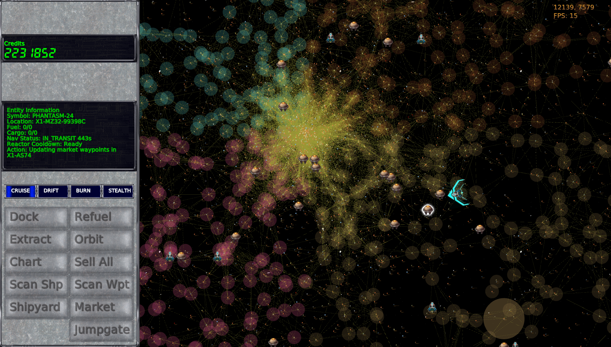
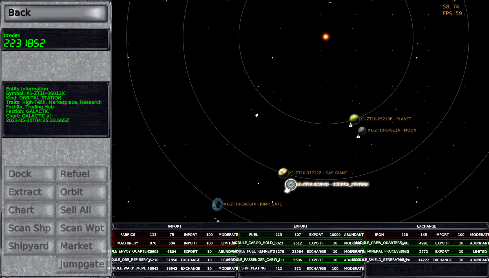
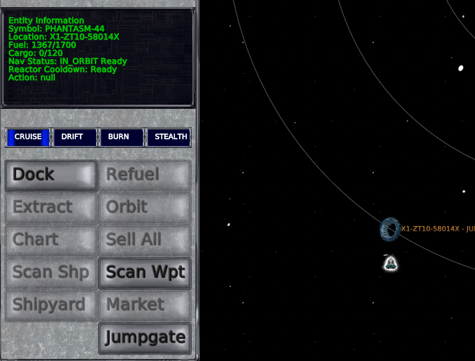

Spacetraders UI
=====

Allows you to look at and directly control your [SpaceTraders](https://spacetraders.io/) ships. It uses PixiJS to display everything, and tRPC/PRisma on the backend to keep track of information.

Global instance (not yet available, will be here): https://ui.st-meta.net

Information in the global instance can be remotely interacted with using the API endpoints at https://api.st-meta.net (this one is available, but not complete).

__Currently implemented__:
- Navigation (right click waypoint)
- Navigation method selection (Cruise/Drift/Burn/Stealth)
- Warp/Jump/Jump through jump-gate (right click other system)
- Hint icons indicating what kind of waypoints/features can be found in systems
- Dock/Orbit/Extract/Refuel/Chart/Sell (all)/Scan ships/Scan waypoints/Shipyard/Market commands
- View market information for selected market
- View basic ship information
- View the entire universe and ship locations, or local system ship locations.
- Warp lines between systems (when discovered)

__To come__:
- UI overhaul
- View detailed ship information (components)
- View list of ships
- View of systems
- Overlay for market information
- More unique graphics for ships/systems/waypoints

Screenshots
-----
Galaxy view shows the entire galaxy (as discovered so far)

System view shows you all the waypoints in the system

Commands become active when available (subject to best information available)

Installation
-----

To be written/figured out

Contributing
-----

If you can figure out how to get it to run, you are welcome to contribute.